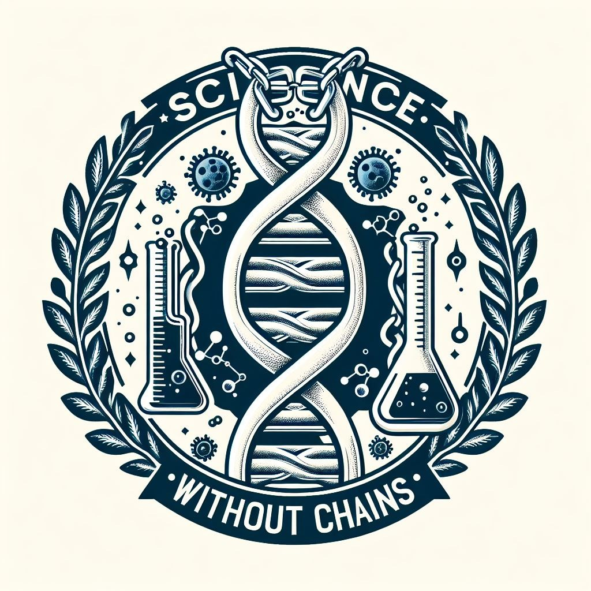

# Science without chains

## About Us
Our goal is to build a **_web site_**  where **_researchers_** can upload their projects for free, take feedback from other researchers, make sure no one can steal their job while making it **_accessible_** for people interested in the research that are in the platform.

We want researchers to feel safe with us, ensuring that their ideas will be recognized as theirs, and wouldn’t be stolen, while, at the same time, people can access to their research or projects.

When a researcher logs into our web we give them a **_unique private key_**, which is linked to their account, projects and research uploaded in our web, this help to give them **_intellectual property_** of the uploaded docs. We save the docs, create a unique key for them, and then we link both keys to build the relationship between researcher and research. We want to make the docs accessible to everyone while maintaining your property secure. 

When you upload a document, people who can see it also can give you feedback and help you to improve your research, they can suggest forms to make more efficient usage of resources, or they can fund your research and help you to advance.
## Technologies
Due to our few knowledge about blockchain technology, we are making use of the programming language **PHP** to create a unique private key for the researchers based on certain specific information about them, by uploading the docs to a server and creating a unique token for it.

## Links
* *[Pitch Deck](https://github.com/)*
* *[Deployment](https://github.com)*
